# latihanvcs
## Tampilan gambar dan penjelasan

### PROCCES MENGINSTALL GIT
ketik di kolam pencarian di google git-scm.com 

 dan download git dan install ini adalah tampilannya
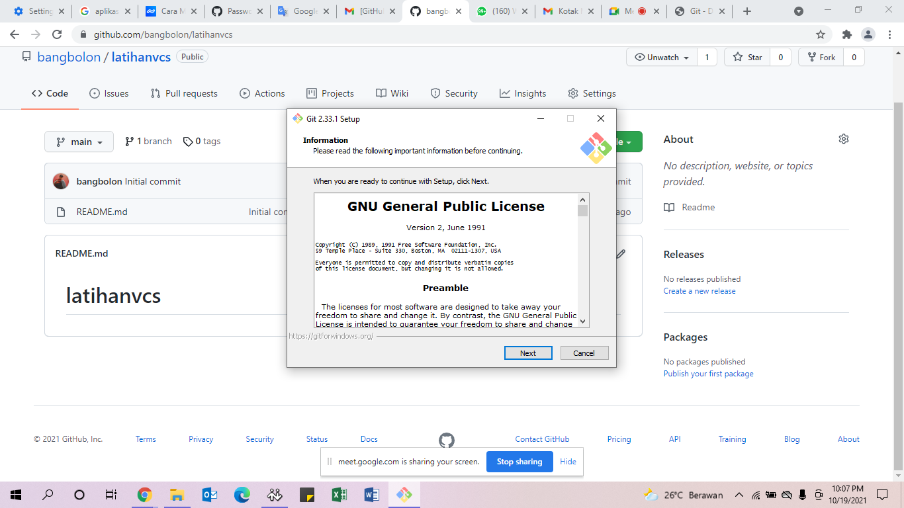

### PROCCES MENGINSTALL GIT
dan setelah diinstall ikutkan alur installasi software git 

klik next untuk melanjutkan process selanjutnya
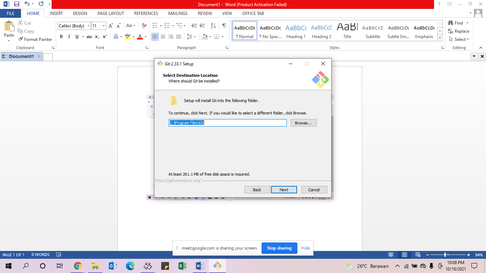

### PROCCES MENGINSTALL GIT
dan untuk procces ini hanya lanjut klik "Next" saja 

dan masuk procces lebih lanjut lagi
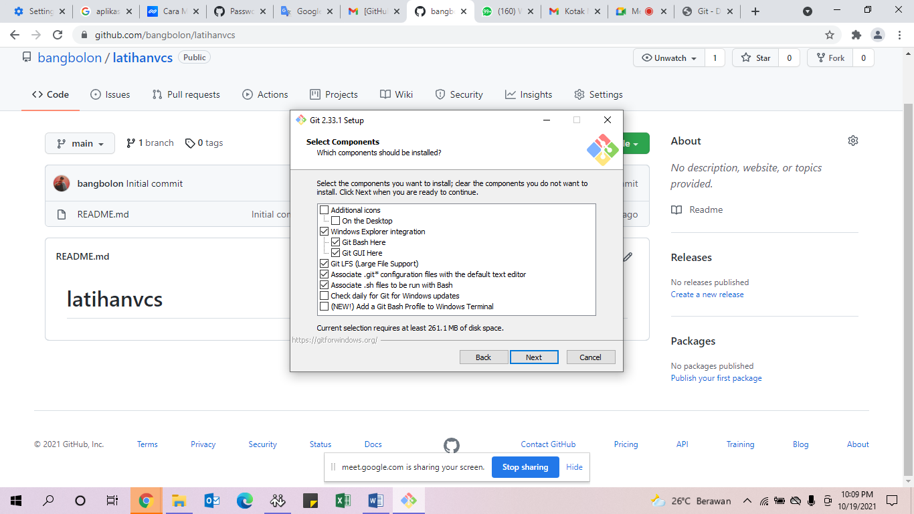

### PROCCES MENGINSTALL GIT
dan untuk procces ini sama seperti diatas hanya "Next saja 

dan lanjut untuk procces selanjutnya
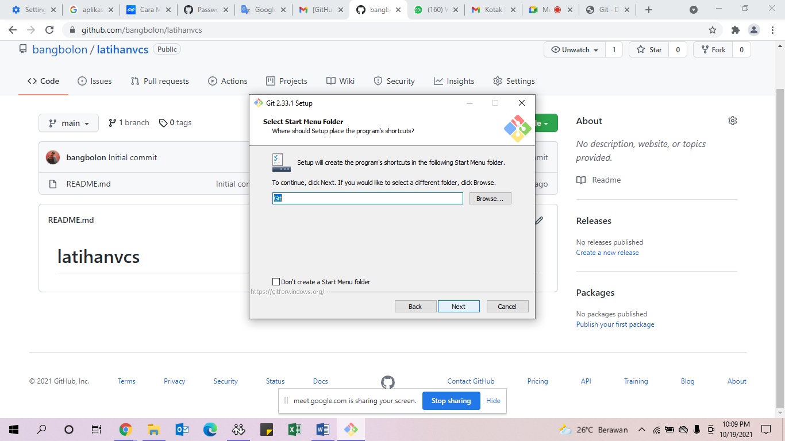

### PROCCES MENGINSTALL GIT
untuk procces ini juga bisa langsung di "Next" saja 

untuk lebih lanjut memperocces install
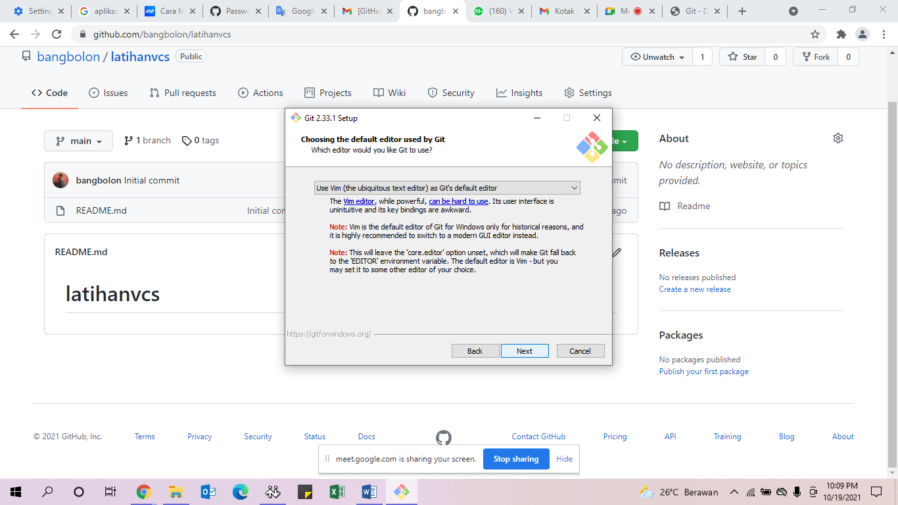

### PROCCES MENGINSTALL GIT
dan untuk procces ini sama seperti diatas hanya "Next" 

untuk memasuki procces lebih lanjut install
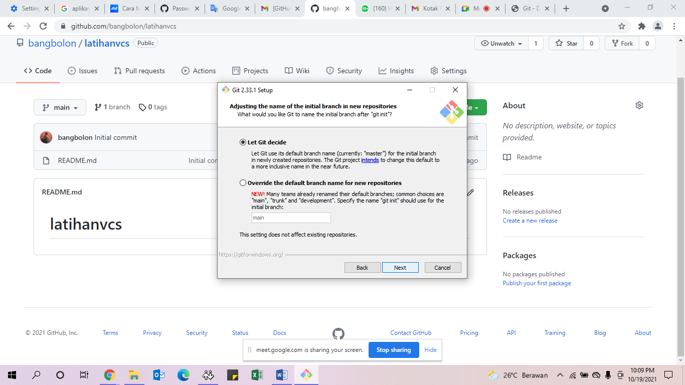

Dan gambar dibawah ini juga sama seperti diatas 

hanya "Next" aja untuk memperocces install selanjutnya
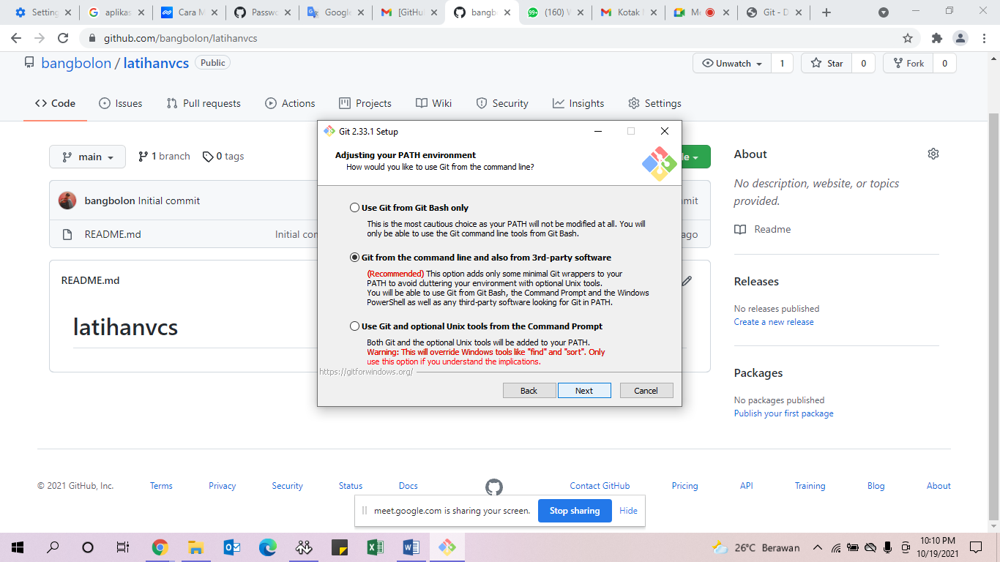

Sama seperti diatas untuk procces ini juga hanya "Next" 

agar melanjutkan procces install
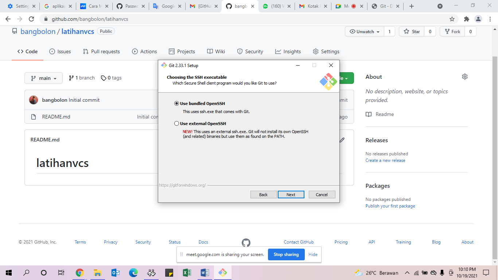

"Next" saja
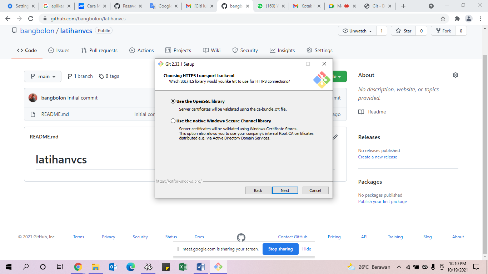

"Next"
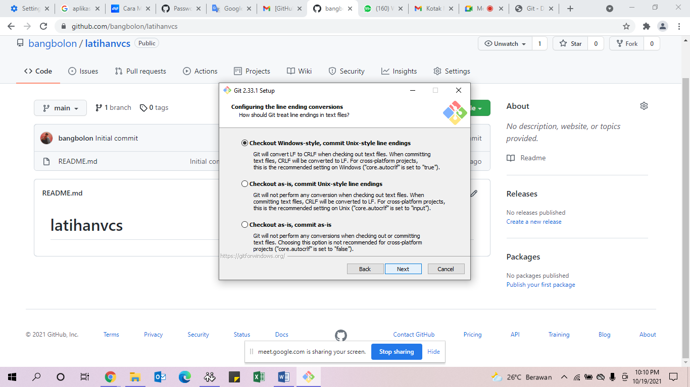

"Next" lagi saja
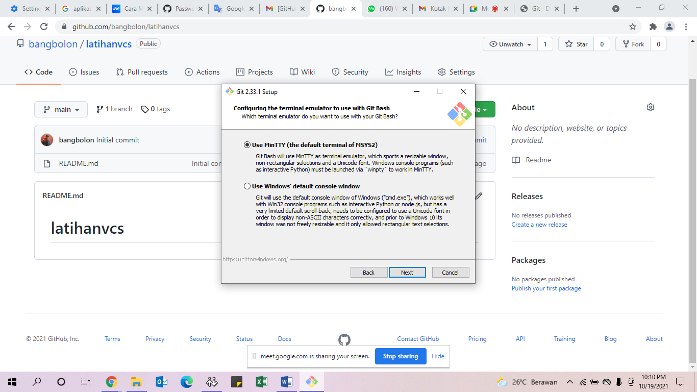

"Next"
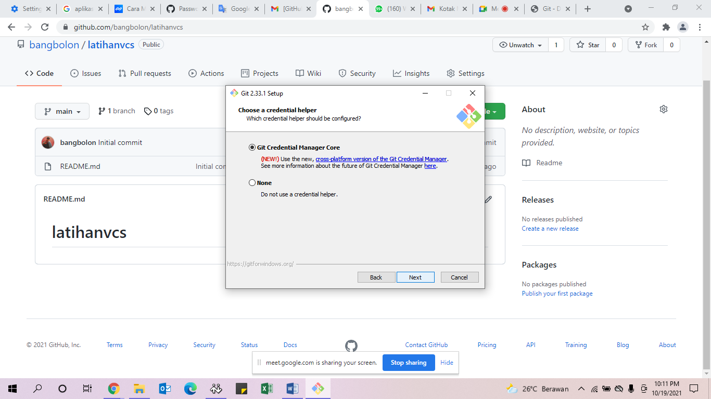

Dan untuk Procces ini klik Install untuk lebih lanjut
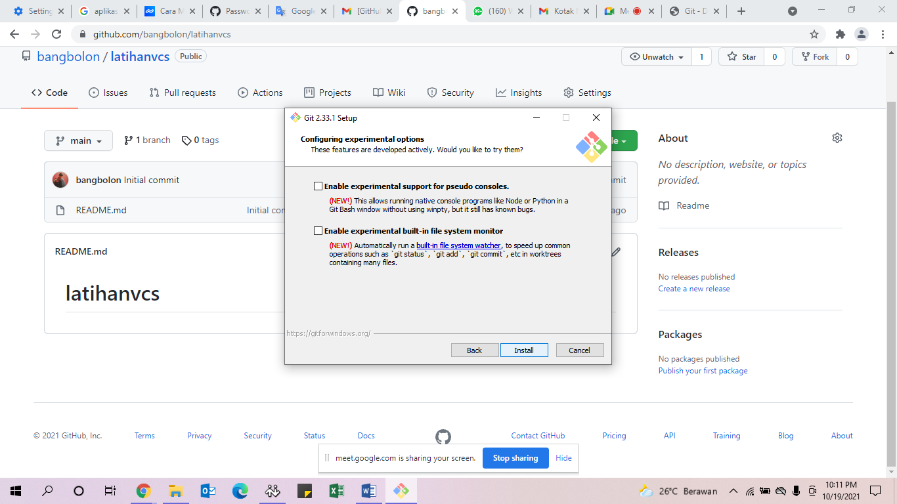

dan untuk gambar dibawah klik saja  Finish 

dan untuk install git Selesai
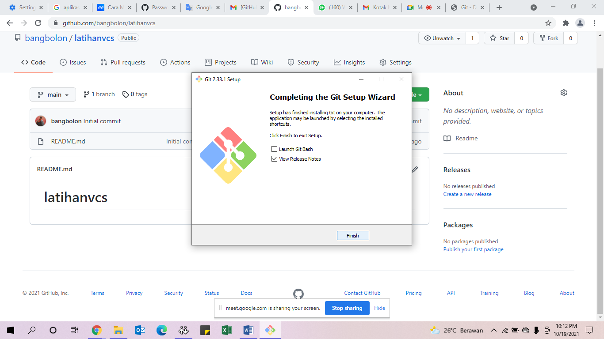

dan untuk procces selanjutnya tinggal kita connect kan ke gibhub 

tetapi terlebih dahulu daftar gibhub dulu dan jika anda sudah 

memiliki akun gibhub bisa langsung connect kan saja

dan jika anda sudah memiliki akun gibhub 

silakan anda masuk terlebih dahulu
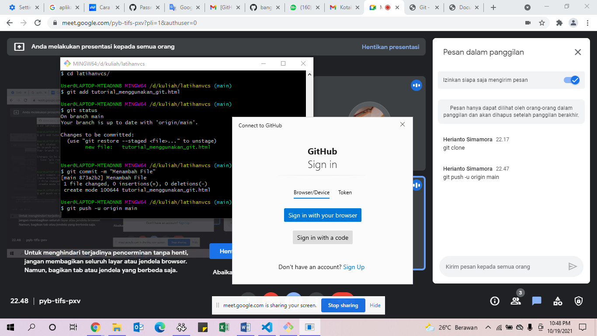

dan setelah itu tinggal kita connect kan saja ke github 

dan klik saja "Authorize" -SELESAI-
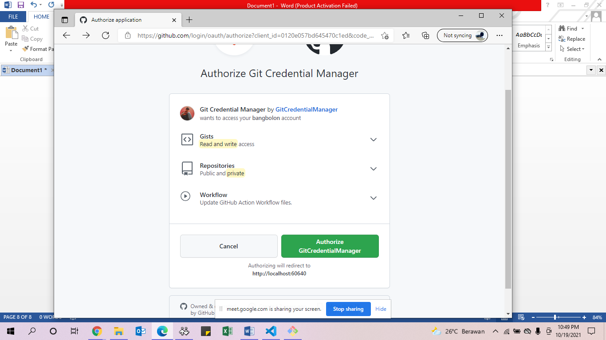

git init : untuk membuat repository pada file lokal 

           yang nantinya ada folder git
git status : untuk mengetahui status dari repository lokal
git add : menambahkan file baru pada repsoitory yang dipilih
git commit : untuk menyimpan perubahan yang dilakukan 

             tetapi tidak pada perubahan pada remote repository
git push : untuk mengirimkan perubahan file setelah di commit
            ke remote repsoitory 

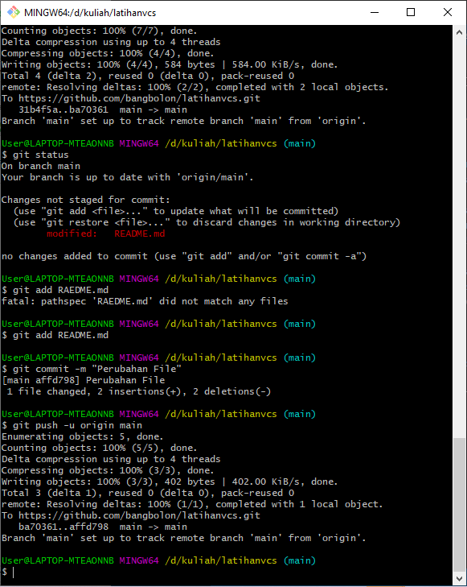